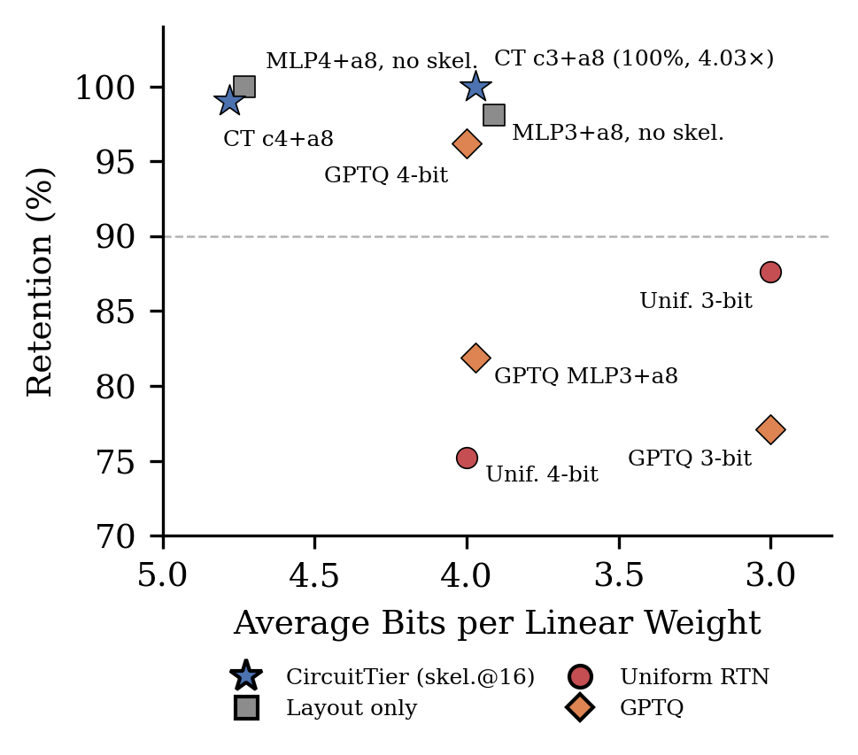
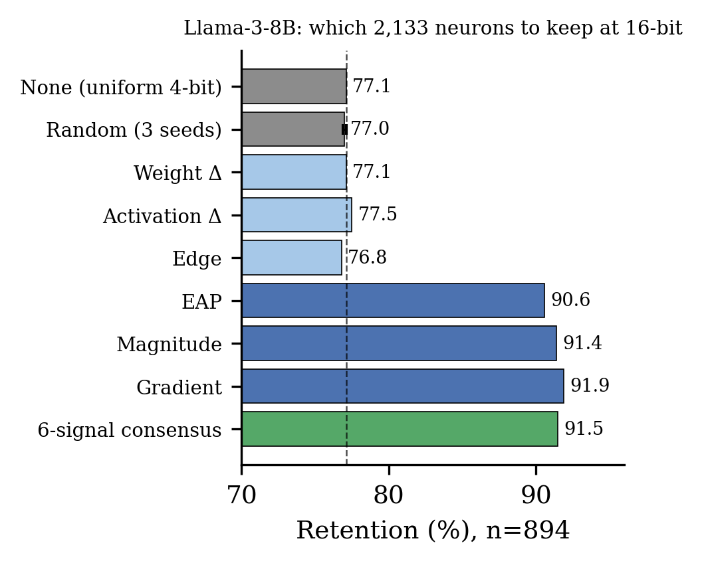
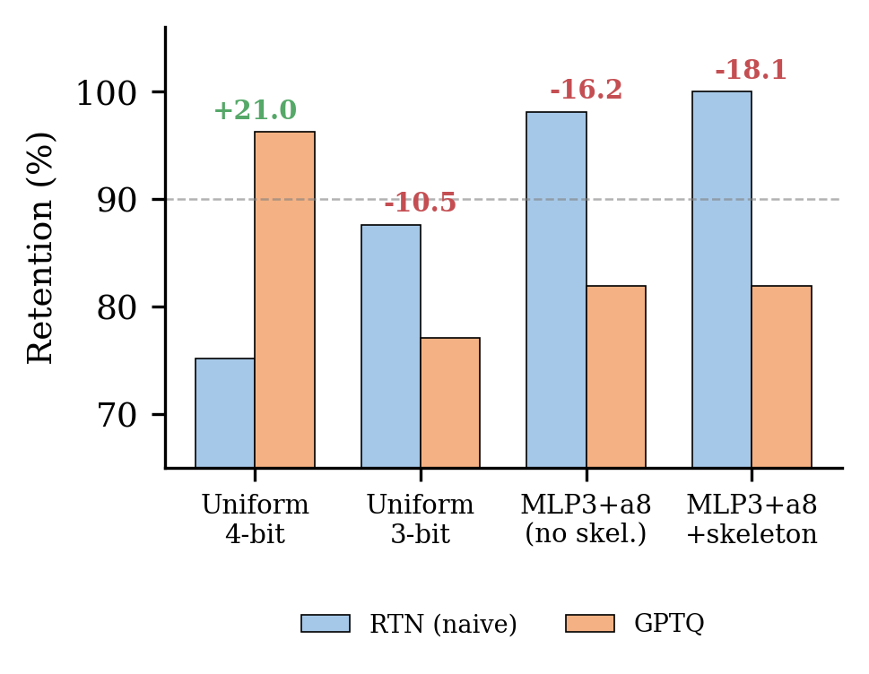

# CircuitTier: Multi-Signal Interpretability Identifies Task-Critical Circuits for Efficient Model Compression

**Srikar Vardhan Mangadoddi** · National Institute of Technology Silchar · Petavue
**Findings of AACL-IJCNLP 2026** · [Paper (PDF)](paper/ACL_2026_CircuitTier.pdf)

CircuitTier combines six interpretability signals to select a sparse *skeleton* of task-critical MLP neurons in a fine-tuned language model, keeps that skeleton at 16-bit, and quantizes everything else. Every number in the paper corresponds to a JSON file in `results/`.

---

## Main results

### Gemma-2-2B fine-tuned for SQL (TinySQL), n = 105 baseline-correct samples

| Method | Bits | Ratio | Retention % |
|---|---|---|---|
| Uniform 4-bit | 4.00 | 4.00× | 75.2 |
| Uniform 3-bit | 3.00 | 5.33× | 87.6 |
| GPTQ uniform 4-bit | 4.00 | 4.00× | 96.2 |
| GPTQ uniform 3-bit | 3.00 | 5.33× | 77.1 |
| MLP@4 + attn@8, no skeleton | 4.73 | 3.38× | 100.0 |
| CircuitTier c4+a8 | 4.78 | 3.35× | 99.0 |
| MLP@3 + attn@8, no skeleton | 3.91 | 4.09× | 98.1 |
| **CircuitTier c3+a8** | **3.97** | **4.03×** | **100.0** |
| GPTQ MLP@3 + attn@8 (± skeleton) | 3.97 | 4.03× | 81.9 |

c*b*+a*b′*: skeleton at 16-bit, all other MLP weights at *b*-bit, attention at *b′*-bit. Per-group round-to-nearest, g = 128. On this model the precision layout does the work; the 0.54% skeleton is a free safeguard.



### Llama-3-8B fine-tuned for Cypher (Text2Cypher), n = 894

Uniform 4-bit on all projections, with 2,133 MLP neurons (0.46%) restored to 16-bit. Rows differ only in *which* neurons are restored.

| Restored to 16-bit | Retention % |
|---|---|
| None (uniform 4-bit) | 77.1 |
| Random, 3 seeds | 77.0 ± 0.1 |
| Weight Δ top-2,133 | 77.1 |
| Activation Δ top-2,133 | 77.5 |
| Edge top-2,133 | 76.8 |
| EAP top-2,133 | 90.6 |
| Magnitude top-2,133 | 91.4 |
| Gradient top-2,133 | 91.9 |
| **Six-signal consensus (P = 99)** | **91.5** |

Where uniform quantization leaves headroom, the signal-selected skeleton recovers 14.4 of the 23 points lost; a random skeleton of the same size recovers none. Three signals are individually effective, three are not, and the effective set differs from Gemma, which is why the consensus rule is used.



### Negative results

- **GPTQ degrades 3-bit layouts** by 16 to 18 points regardless of which neurons are protected, while helping at 4-bit (75.2 → 96.2). Not caused by contamination of protected weights; sensitive to Hessian damping and platform numerics. See `paper/`, Appendix F.
- **Zeroing the "prunable" tier is harmful**: removing the 48 neurons all six signals rank lowest drops c4+a8 from 99.0 to 91.4.
- **The original submission's random-vs-smart reliability gap was a quantizer artifact** (gathered-subset grouping in `down_proj`). With aligned protect-by-restore quantization it disappears. Documented in Appendix E; the affected February runs are kept in `results/gemma_original/` and marked.



---

## Method in one paragraph

Six signals are computed for every MLP neuron of the fine-tuned model: activation patching (EAP), gradient saliency, weight magnitude, weight delta vs. the base checkpoint, activation delta vs. the base checkpoint, and edge importance (attention-head → neuron patching scores). Each is min-max normalized. A neuron joins the skeleton if at least three signals exceed a threshold (absolute τ = 0.3 on Gemma; per-signal 99th percentile on Llama), or if EAP and one of gradient / activation delta do. The model is quantized per-group (g = 128) as full matrices, and skeleton rows of `gate_proj` / `up_proj` and columns of `down_proj` are restored from the original weights. Attention is kept at 8-bit on Gemma (attention precision dominates there) and 4-bit on Llama (matched to the uniform baseline).

---

## Repository layout

```
paper/                      LaTeX source, bib, figures, final PDF
notebooks/
  gemma_01_finetune.ipynb        Gemma-2-2B full fine-tune on TinySQL (A40)
  gemma_02_signals.ipynb         six-signal extraction, tier classification
  gemma_03_compression.ipynb     February compression runs (original submission)
  gemma_04_camera_ready_reruns.ipynb   all Sept 2026 reruns, aligned quantizer, Gemma + Llama
  llama_01_finetune.ipynb        Llama-3-8B full fine-tune on Text2Cypher (A100)
results/
  gemma_original/           February 2026 Gemma results (gathered-subset quantizer)
  gemma_reruns_sept2026/    Sept 2026 Gemma reruns: E0–E8, T1_* (aligned quantizer)
  llama_original/           Feb/Mar 2026 Llama sweeps (earlier protocol, n = 100 / 1,000)
  llama_reruns_sept2026/    Sept 2026 Llama selection experiment, E9_*, per-sample .npy (n = 894)
  llama_test_splits/        test_CY1..CY5.json
explorer/explorer.html      interactive 3D circuit explorer (open in a browser, no install)
LARGE_FILES.md              where the signal arrays, checkpoints, and calibration data live
```

### Which file backs which number

| Paper | File |
|---|---|
| Table 2(a) uniform / GPTQ rows | `results/gemma_original/RETENTION_FINAL.json`, `results/gemma_reruns_sept2026/E6_gptq_*.json` |
| Table 2(a) CircuitTier / no-skeleton rows | `results/gemma_reruns_sept2026/T1_aligned_*.json`, `E1fix_c3a8_none.json` |
| Table 2(b) skeleton selection | `E1fix_c3a8_*.json`, `E5_tacq_top1295_c3a8.json`, `E7_P99*_c3a8.json` |
| Table 3 (Llama) | `results/llama_reruns_sept2026/E9_llama_rebased_summary.json` and `*_persample.npy` |
| §4.4 prunable tier | `T1_aligned_c4a8.json` vs `T1_aligned_c4a8_noprune.json` |
| Appendix D signal ablation | `results/gemma_original/ABLATION_FAIR.json`, `E1_random_seed*.json` |
| Appendix E quantizer artifact | `E1_c3a8_*`, `E1_c3a4_*` (gathered) vs `E1fix_c3a8_*`, `E8_*` (aligned) |
| Appendix F GPTQ | `E6_*.json`; February values in `results/gemma_original/RETENTION_FINAL.json` |
| Appendix G thresholds | `E3_tau*.json`, `E7_*.json` |
| Appendix K perplexity | `E4_wikitext_ppl.json` |
| Appendix L compression wall | `results/llama_original/radical_results.json`, `qat_results.json` |

Llama retention in `E9_*` is re-based on the 894 of 1,000 samples the 16-bit model reproduces under batched decoding (`fp16_persample.npy`); the per-sample arrays let you recompute any subset.

---

## Reproducing

Signal extraction and quantization run on a single 32 to 48 GB GPU. Fine-tuning notebooks need more (A40 for Gemma, A100-80GB for Llama).

```bash
pip install -r requirements.txt
huggingface-cli login          # needed for the Gemma and Llama checkpoints
```

1. `notebooks/gemma_04_camera_ready_reruns.ipynb` downloads the fine-tuned Gemma checkpoint, signals, and tier arrays from Hugging Face (see `LARGE_FILES.md`), defines the aligned quantizer, and reproduces every Gemma row of the paper. Cell E0 must return 101/105; that is the pipeline check. The Llama section of the same notebook reproduces Table 3.
2. `gemma_02_signals.ipynb` recomputes the six signals from scratch (several hours; activation patching dominates).
3. `gemma_01_finetune.ipynb` and `llama_01_finetune.ipynb` reproduce the fine-tunes.

The February notebook `gemma_03_compression.ipynb` is kept for provenance of `results/gemma_original/`; it uses the gathered-subset quantizer and its numbers are superseded where the paper says so.

---

## Data and models

- TinySQL: [`withmartian/cs1_dataset` … `cs5_dataset`](https://huggingface.co/withmartian) (Harrasse et al., 2025)
- Text2Cypher: [`neo4j/text2cypher-2024v1`](https://huggingface.co/datasets/neo4j/text2cypher-2024v1) (Ozsoy et al., 2024)
- Base models: Gemma-2-2B, Meta-Llama-3-8B (gated; accept the licenses on Hugging Face)

Fine-tuned checkpoints, signal arrays, and calibration data: see [`LARGE_FILES.md`](LARGE_FILES.md).

## Citation

```bibtex
@inproceedings{mangadoddi2026circuittier,
  title     = {Multi-Signal Interpretability Identifies Task-Critical Circuits for Efficient Model Compression},
  author    = {Mangadoddi, Srikar Vardhan},
  booktitle = {Findings of the Association for Computational Linguistics: AACL-IJCNLP 2026},
  year      = {2026}
}
```

## License

Code and results: MIT (see `LICENSE`). Model checkpoints inherit the Gemma and Llama 3 licenses. Datasets are under their original licenses.
